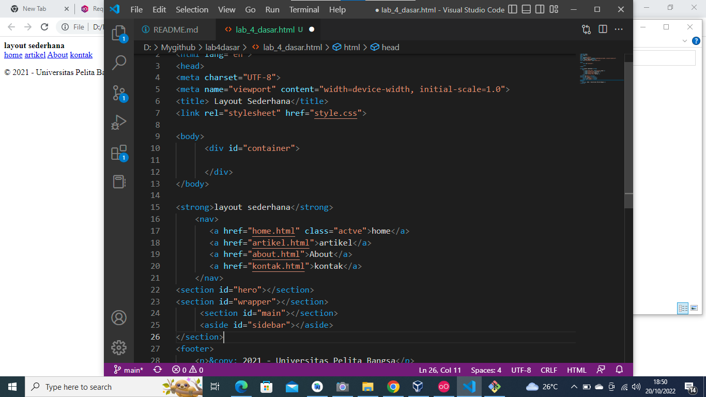
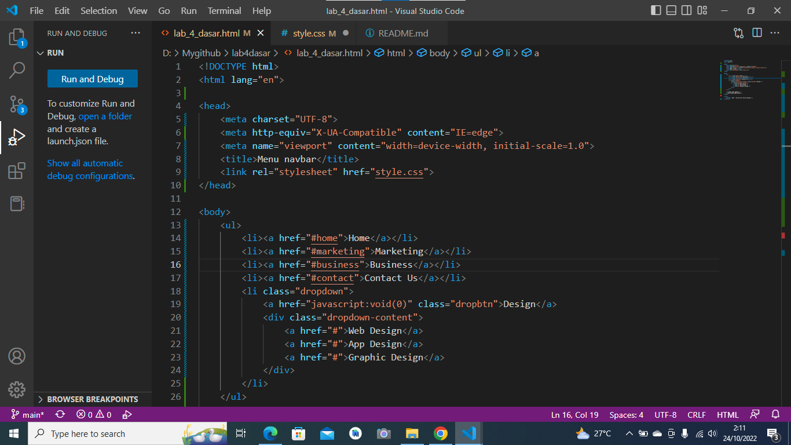
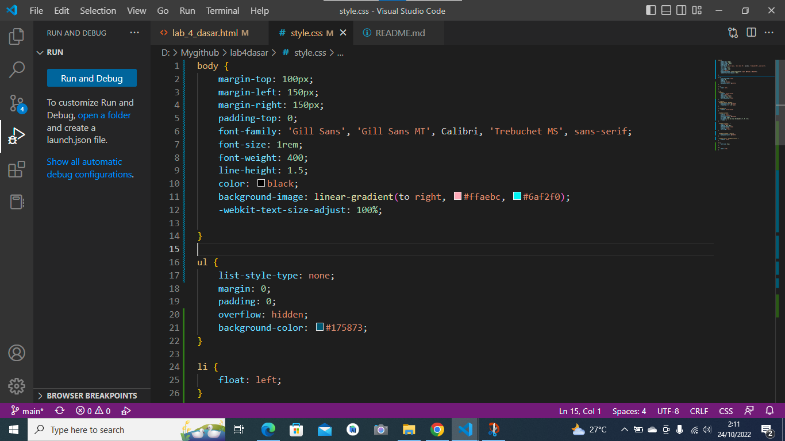
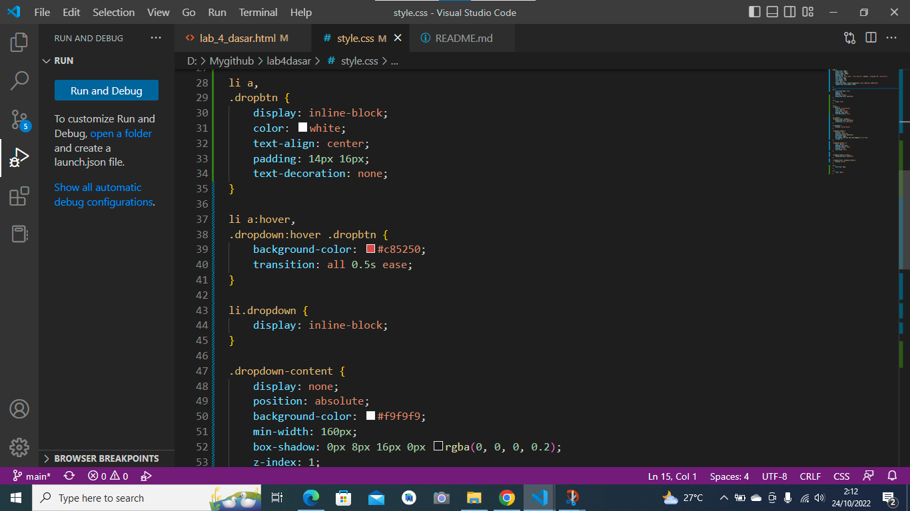
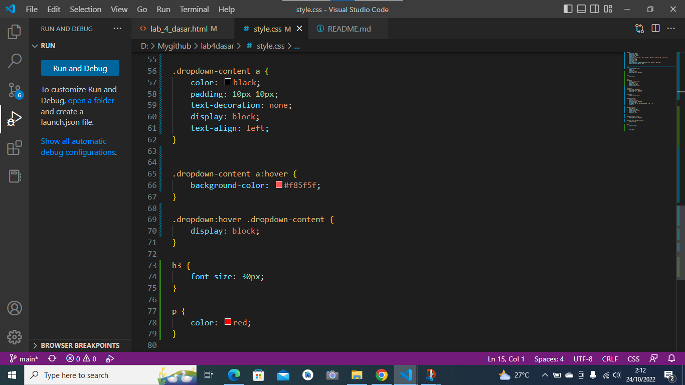
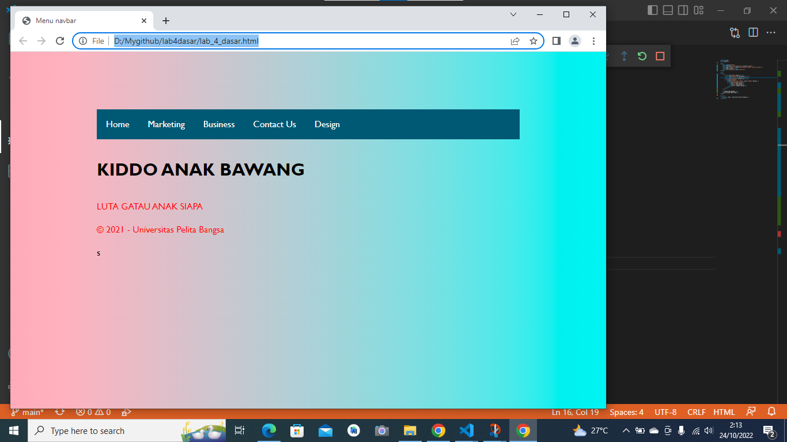

# lab4dasar

# hai

1. membuat layout sederhana terlebih dahulu ini syntax nya dengan tampilannya

2. membuat tampilan pada html dengan style css

3.membuat kerangka tampilan untuk dropdown dari html dan css

4.membuat list dropdown dari efek html dan css

5. dan ini tampilan akhir dari menu dan list nya
